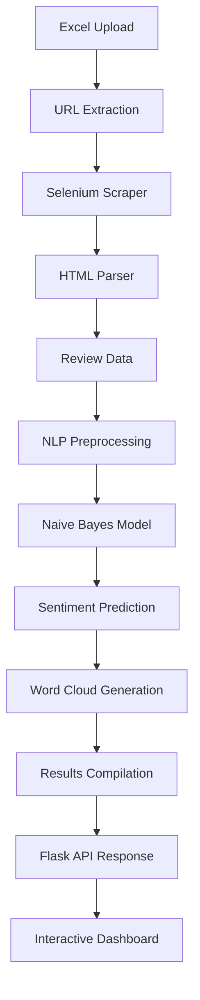

# 🎯 Sentiment Analyzer Pro

[](https://www.python.org/downloads/)
[](https://flask.palletsprojects.com/)
[](LICENSE)
[](https://selenium-python.readthedocs.io/)

> **An AI-powered web application that scrapes, analyzes, and visualizes customer sentiments from Amazon product reviews using advanced NLP techniques.**

Sentiment Analyzer Pro is a comprehensive solution for businesses, researchers, and e-commerce analysts who need to understand customer opinions at scale. Built with modern web technologies and machine learning, it transforms thousands of Amazon reviews into actionable insights through automated sentiment analysis, word cloud visualization, and interactive reporting.


---

## 🚀 Key Features

### 🔍 **Advanced Web Scraping**

* **Headless Chrome Automation**
* **Anti-Detection Measures**
* **Dual Review Sources**
* **Robust Error Handling**

### 🧠 **Machine Learning-Powered Analysis**

* **Pre-trained Naive Bayes Model**
* **TF-IDF Vectorization**
* **Sentiment Mapping**
* **Accuracy Metrics**

### 📊 **Rich Data Visualization**

* **Interactive Word Clouds**
* **Sentiment Distribution Charts**
* **Product Comparison Tools**
* **Detailed Review Insights**

### 🎨 **Modern Web Interface**

* **Responsive Design**
* **Drag & Drop Upload**
* **Real-time Processing**
* **Export Capabilities**

---

## 🏗️ Architecture Overview



---

## 🛠️ Technology Stack

| Category             | Technologies                    |
| -------------------- | ------------------------------- |
| **Backend**          | Python, Flask                   |
| **Web Scraping**     | Selenium, WebDriver Manager     |
| **Machine Learning** | scikit-learn, NLTK              |
| **Data Processing**  | Pandas, openpyxl                |
| **Frontend**         | HTML5, Tailwind CSS, JavaScript |
| **Visualization**    | WordCloud, Matplotlib           |

---

## 📋 Prerequisites

* **Python 3.8+**
* **Google Chrome**
* **Git**
* **Virtual Environment** (recommended)

### System Requirements

* **RAM**: 4GB minimum (8GB recommended)
* **Storage**: 2GB
* **Network**: Stable connection

---

## ⚡ Quick Start

### 1. Clone the Repository

```bash
git clone https://github.com/cayanide/Data-Extraction-and-NLP.git
cd Data-Extraction-and-NLP
```

### 2. Set Up Virtual Environment

```bash
python -m venv sentiment_analyzer_env
# Activate virtual environment
# Windows:
sentiment_analyzer_env\Scripts\activate
# macOS/Linux:
source sentiment_analyzer_env/bin/activate
```

### 3. Install Dependencies

```bash
pip install -r requirements.txt
```

### 4. Download NLTK Data

```bash
python -c "import nltk; nltk.download(['stopwords', 'punkt'])"
```

### 5. Add Required Models

* `NB_model.pkl`
* `vectorizer.pkl`

> If missing, train using a labeled dataset.

### 6. Launch the App

```bash
python main.py
```

Navigate to `http://localhost:8050`

---

## 📖 Detailed Usage Guide

### 1. Prepare Input File

| URL\_ID    | URL                                                                          |
| ---------- | ---------------------------------------------------------------------------- |
| B08J4C2D2S | [https://www.amazon.com/dp/B08J4C2D2S](https://www.amazon.com/dp/B08J4C2D2S) |

### 2. Upload and Analyze

* Open `http://localhost:8050`
* Upload Excel file
* Click "Analyze Reviews"

### 3. Review Results

* Sentiment Distribution
* Average Rating
* Total Reviews
* Accuracy Score
* Word Clouds

### 4. Export Data

* Excel Report
* Product Insights
* Word Cloud Images

---

## 🗂️ Project Structure

```
Data-Extraction-and-NLP/
├── main.py
├── index.html
├── requirements.txt
├── README.md
├── NB_model.pkl
├── vectorizer.pkl
├── static/
│   ├── uploads/
│   ├── output/
│   └── wordclouds/
├── Products/
└── templates/
```

---

## ⚖️ Configuration Options

### Selenium Configuration

```python
options = Options()
options.add_argument('--headless')
options.add_argument('--no-sandbox')
options.add_argument('--disable-dev-shm-usage')
options.add_argument('--disable-gpu')
options.add_argument('--window-size=1920,1080')
```

### Model Parameters

* Mapping: `{0: "negative", 1: "neutral", 2: "positive"}`
* Word Cloud: 800x400, white background

---

## 🔎 API Endpoints

| Endpoint                        | Method | Description               |
| ------------------------------- | ------ | ------------------------- |
| `/`                             | GET    | Main dashboard            |
| `/upload`                       | POST   | Upload and process file   |
| `/results`                      | GET    | Get analysis results      |
| `/download`                     | GET    | Download Excel report     |
| `/product-details/<name>`       | GET    | Product-specific insights |
| `/static/wordclouds/<filename>` | GET    | Word cloud images         |

### Example:

```python
files = {'file': open('products.xlsx', 'rb')}
response = requests.post('http://localhost:8050/upload', files=files)
results = requests.get('http://localhost:8050/results').json()
```

---

## 🚨 Troubleshooting

### Chrome Driver Issues

```bash
pip install --upgrade webdriver-manager
```

### Missing Model Files

Ensure `NB_model.pkl` and `vectorizer.pkl` are in the root folder.

### Memory Issues

* Process smaller batches
* Upgrade RAM if needed

### Timeout Errors

* Check connection
* Increase timeout values

### Enable Debug

```bash
python main.py --debug
```

---

## 🧪 Testing

### Unit Tests

```bash
python -m pytest tests/ -v
```

### Manual Checklist

* [ ] File upload
* [ ] Excel parsing
* [ ] Scraping
* [ ] Sentiment analysis
* [ ] Word clouds
* [ ] Export features

---

## 🚀 Performance Optimization

### Scraping

* Use threading
* Implement caching
* Add rate limiting

### Model

* Batch processing
* Upgrade to transformers
* Optimize preprocessing

---

## 🤝 Contributing

### Setup

```bash
git checkout -b feature/amazing-feature
```

* Add docstrings, tests, and update docs
* Follow PEP 8

### Areas to Help

* Multi-language support
* More visualizations
* Database support
* API rate limiting
* Mobile UI
* Cloud deployment

---

## 📊 Roadmap

### v2.0 (Planned)

* Real-time sentiment
* Multi-platform
* Mobile app
* Cloud integration

### v2.1 (Future)

* Transformers
* Trend forecasting
* Business tool integrations
* Enterprise features

---

## 📄 License

MIT License - See [LICENSE](LICENSE)

---

## 📞 Support & Contact

* [GitHub Issues](https://github.com/cayanide/Data-Extraction-and-NLP/issues)
* [GitHub Discussions](https://github.com/cayanide/Data-Extraction-and-NLP/discussions)
* Email via GitHub profile

---

## 🙏 Acknowledgments

* Amazon
* NLTK
* Selenium
* Flask
* Open source community

---

<div align="center">

**Built with ❤️ by [cayanide](https://github.com/cayanide)**

*Sentiment Analyzer Pro - Transforming customer feedback into business intelligence*

[](https://github.com/cayanide/Data-Extraction-and-NLP)
[](https://github.com/cayanide/Data-Extraction-and-NLP)

</div>
